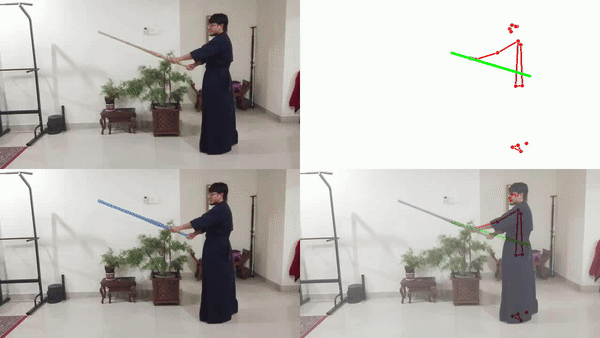

# Project AI Kendo

A proof-of-concept AI system for analyzing Kendo movements, combining pose estimation and shinai tracking. Born from training at Ai Kendo Malaysia, this project aims to help practitioners analyze and improve their form.

## What It Currently Does

- Tracks and analyzes Kendo movements from video
- Detects shinai position and angle
- Classifies cuts (small_cut/big_cut)
- Generates visualization videos and analytical data

## Tech Stack

- **Pose Estimation**: MediaPipe Blazepose
- **Shinai Detection**: EVF-SAM2
- **Backend**: FastAPI
- **Video Processing**: OpenCV

## Quick Start

### Prerequisites

- Ensure you have Python installed. The project has been tested on **Python 3.11**.
- If Python 3.11 is unavailable, please use a version close to 3.10+ as certain libraries may require modern Python features. Check [Python Downloads](https://www.python.org/downloads/) for installation.

### Setup Instructions

1. **Clone and Navigate to the Repository**:
   ```bash
   git clone https://github.com/XpressAI/project-ai-kendo
   cd project-ai-kendo
   ```

2. **Run the Setup Script**:
   This script will set up the required environment, install dependencies, and download the necessary model checkpoints.
   ```bash
   bash setup.sh
   ```

3. **Place Your Videos**:
   Add your input videos to the `input_videos/` directory.

4. **Run the Application**:
   Start the main processing script:
   ```bash
   python backend/main.py
   ```


## Output Examples

- Multiple visualization videos (original/pose/segmented views)



- Frame-by-frame breakdowns
- Angle analysis visualizations

- Analysis data in JSON format

```
{
    "kamae_angle": 4.321947987720705,
    "cut_angle": -38.23131546090542,
    "cut_classification": "big_cut",
}
```

## To Be Added

- Automatic swing video trimmer (currently only supports 1 swing video at a time)
- Multi-angle support (front view)
- More detailed pose-based corrections:
  - Arm raising during strikes
  - Shinai pullback analysis
  - Foot positioning checks

## Learn More

Check out the detailed blog post: [Whack, Track, Repeat: Creating AI for Kendo Practice](https://xpress.ai/blog/ai-kendo-45)

## Acknowledgements

- [EVF-SAM Team](https://github.com/hustvl/EVF-SAM)
- [MediaPipe Team](https://developers.google.com/mediapipe)
- [Ai Kendo Malaysia](https://www.aikendo.club/)

## License

MIT License